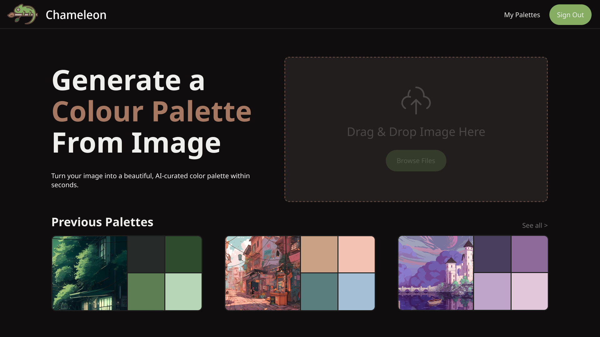

## 💗 Hi, I'm Rachel!
- 🎓 3rd-year B.Sc. Computer Science & Mathematics student at the University of Ottawa  
- 👩🏻‍💻 Vice President of Academic Affairs of the Computer Science Student Association   
- 👩🏻‍🏫 Teaching Assistant for ITI 1121 (Introduction to Computing II)  
- 📝 University-level Tutor for ITI 1120 and ITI 1121 (Python and Java)  
- ✉️ Full-stack developer passionate about AI/ML and UI/UX design

## 🌷 Recent Projects
### 🔍 ADO Tool Suite & Query Creator
A productivity tool that streamlines Azure DevOps workflows by generating and managing queries across multiple projects. Reduces manual setup, ensures consistent sorting and data retrieval, and improves team efficiency.

### 🎨 [Chameleon AI Palette Generator](https://github.com/fenghuang81/chameleon)
Upload any image and let AI generate a cohesive, matching colour palette. Designed to support designers and developers with inspiration for UI, branding, and creative projects.

 

### 💄 [Lush Life Glam](http://github.com/r-chel-i/lush-life-glam)
An interactive dress-up game made in 36 hours for uOttaHack 8. Players are graded based on how well they cater to the customer's requests. UI and assets are hand-made.

## 💻 Tech Stack:

